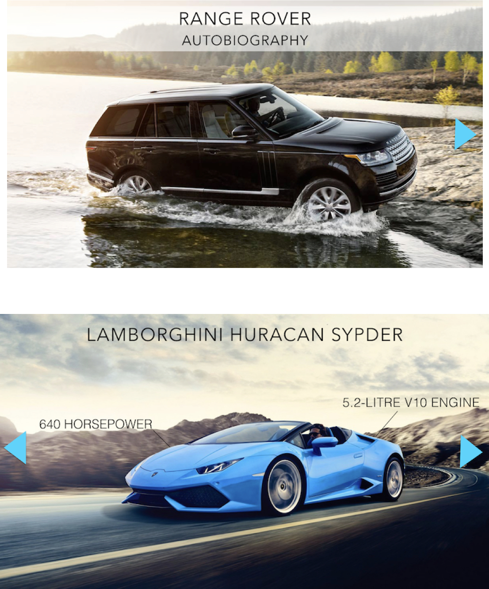
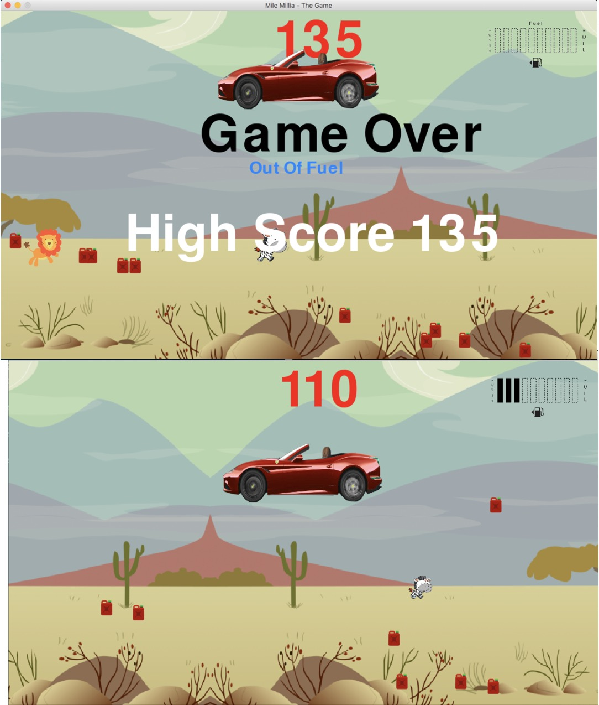

# Mille-Miglia-The-Game
This game named “Mile Millie” after a tough vintage road race. The game allows the player to thrillingly experience a drive through a dessert safari. The key tasks are as follows: [1] Selecting car of preference from the seven selection of World’s renowned luxury car list. [2] Collecting Christmas gift to accumulate high score [3] Collecting Gas Tank to fill the tank, against the decreasing gas by every single second. [4] Keeping the car jumping up against the earth’s gravity to avoid an attack into animal Like real experience, the game creates an illusion that the car is driving through the dessert by the fact that everything is moving except the car. The player will feel very sensational, as in one hand they have to keep collecting Christmas gift to pile up the score, and in other hand, they have to collecting Gas Tank against the decreasing gas in the tank. Not only that, but also they have to push the car jump-up against the gravity to avoid hitting animal. The game will be over with either of the two conditions as follows: [1] Empty Gas [2] Hit animal Using Pygame mixer, entertaining atmosphere by sound and music effects is highly enhanced.

## PROJECT REQUIREMENTS
This project was developed using Python 3 using IDLE ,with the use of Library “Pygame” for the ability to handle basic game functions such as handling simple image and basic animation as well as keyboard input combination in game creation.


## Main Menu

## Car Chooser

## Game Play

